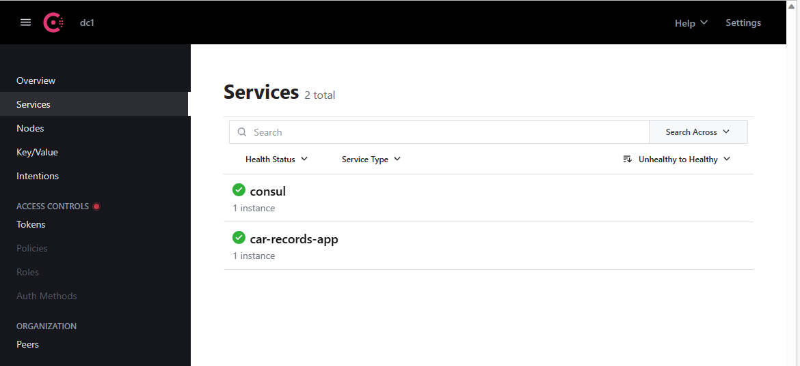
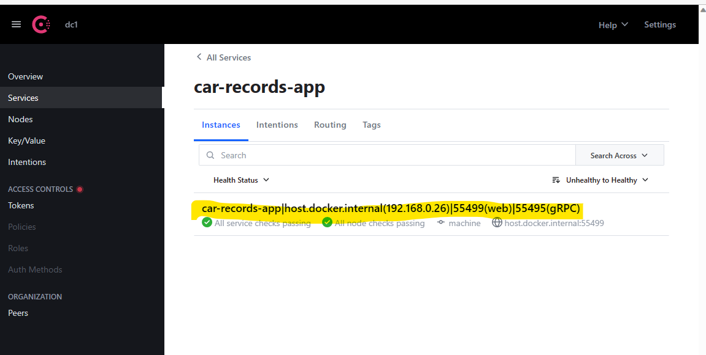

# Car Records  App

## Overview

This is the Grpc Service that handles the saving of booking records.

It registers itself on Consul.

```yml
spring:
  cloud:
    consul:
      host: localhost
      port: 8500
      discovery:
        instanceId: ${spring.application.name}:${${spring.application.instance_id}:${server.port}:${random.value}}
      config:
        enabled: false
```
This configuration in `application.yml` 
```instanceId: ${spring.application.name}:${${spring.application.instance_id}:${server.port}:${random.value}}``` 
is not used.

Custom ID is generated via `com.interview.carrecords.config.custom.ConsulAutoRegistration2#getCustomId()`

## Consul

Install and run [Consul](https://developer.hashicorp.com/consul/downloads).

Run Consul locally e.g. [http://localhost:8500/ui/dc1/services](http://localhost:8500/ui/dc1/services). 

### Consul Services


### Consul Instances
Custom ID is generated via `com.interview.carrecords.config.custom.ConsulAutoRegistration2#getCustomId()`
This configuration in `application.yml`
```instanceId: ${spring.application.name}:${${spring.application.instance_id}:${server.port}:${random.value}}```
is not used.
 


## gRPC services and client
This is a GrpcService. It uses this project to make itself a gRPC servcice.
[grpc-spring-boot-starter](https://github.com/yidongnan/grpc-spring-boot-starter/). Read the [documentation](https://yidongnan.github.io/grpc-spring-boot-starter/en/) for details.

Add following dependency.
```pom.xml
<!--===== gRPC Server Spring Boot starter =====-->
<dependency>
    <groupId>net.devh</groupId>
    <artifactId>grpc-server-spring-boot-starter</artifactId>
    <version>2.14.0.RELEASE</version>
</dependency>
```
Add below to start gRPC service on an available port
```yml
grpc:
  server:
    port: 0
```

`com.interview.carrecords.config.custom.GrpcStarterConfig` is needed as a fix for [https://github.com/yidongnan/grpc-spring-boot-starter/pull/775](https://github.com/yidongnan/grpc-spring-boot-starter/pull/775).

Define the gRPC service as below:

```java
@GrpcService
public class RecordsService extends RecordsServiceGrpc.RecordsServiceImplBase {

    @Override
    public void saveRecord(RecordSaveRequest request, StreamObserver<RecordSaveResponse> responseObserver) {

        RecordSaveResponse recordResp =
                RecordSaveResponse.newBuilder().setRecordId("1").build();

        // set the response object
        responseObserver.onNext(recordResp);

        // mark process is completed
        responseObserver.onCompleted();
    }
}
```
Following are needed. `spring.application.name` is the "name" the service registers on Consul. `spring.boot.admin.client.*` are details to register with Spring Boot Admin.
`spring.cloud.consul.*` are the properties to resister with Consul.

```yaml
spring:
  application:
    name: car-records-app
  boot:
    admin:
      client:
        # Where the Spring boot admin resides
        url: http://localhost:8100
        # When shut down deregisters from spring boot admin
        auto-deregistration: true
  cloud:
    consul:
      host: localhost
      port: 8500
      discovery:
        instanceId: ${spring.application.name}:${${spring.application.instance_id}:${server.port}:${random.value}}
      config:
        enabled: false
        #import: optional:configserver:http://myhost:8888
```